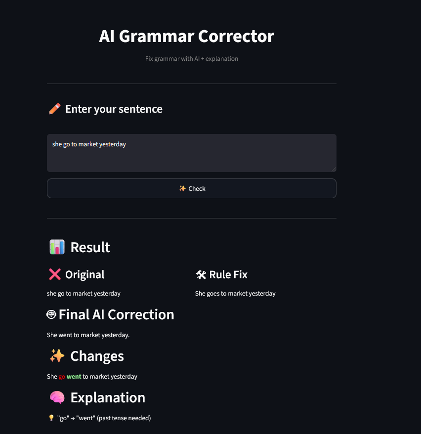

# AI Grammar Corrector

An interactive AI-powered web app that corrects grammar, highlights changes, and explains errors in a clear and user-friendly way.

---

## Overview

This project combines rule-based correction and AI/NLP techniques to improve sentence accuracy.
It not only fixes grammar mistakes, but also shows what changed and why, making it useful for learning English.

---

 ## Features

 - Automatic grammar correction
 - Highlight word-by-word changes
 - Explanation of errors (tense, plural, etc.)
 - Fast and interactive UI (Streamlit)

---

## Preview

---

Tech Stack

- Python
- Streamlit
- NLP (rule-based + difflib)
- Transformers (optional / future upgrade)

---

## How to Run

git clone https://github.com/username/ai-grammar-corrector.git
cd ai-grammar-corrector
pip install -r requirements.txt
streamlit run app.py

---

## Example

- Input:

she go to market yesterday

- Output:

She went to market yesterday.

- Explanation:

"goes" → "went" (past tense required),

---

## Future Improvements

- Add BERT / GPT-based correction,
- Improve explanation system,
- Deploy to Streamlit Cloud,
- Add speech input,

---

Contributing

Feel free to fork this repo and improve it!

---

Contact

If you like this project or want to collaborate, feel free to reach out 
